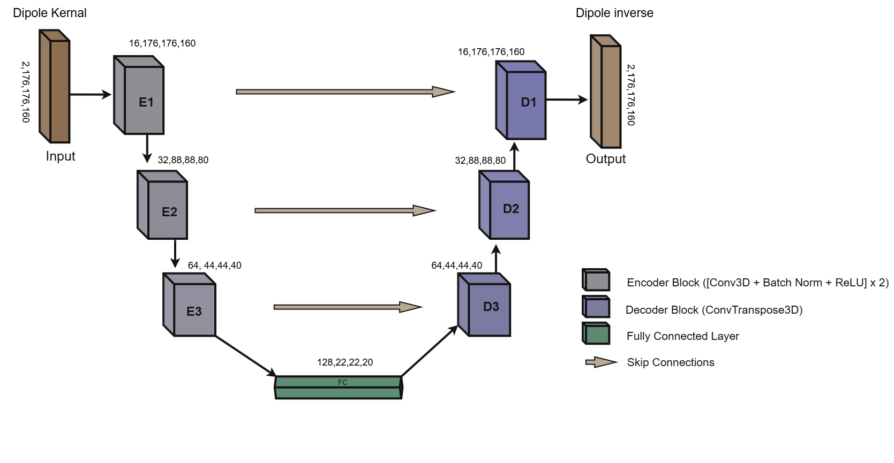
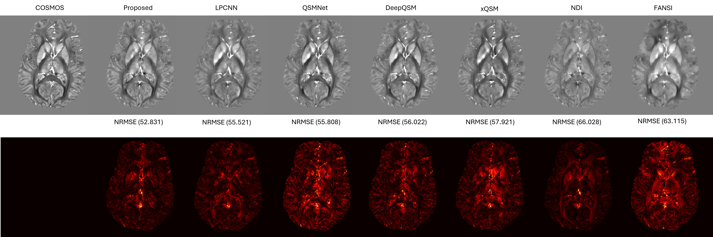

# Parameterized-Dipole-Inversion-for-Stable-Quantitative-Susceptibility-Mapping


A PyTorch implementation of a 3-D UNet that learns to invert the dipole convolution for QSM reconstruction. The network predicts the complex dipole inverse directly from the k-space dipole kernel, enabling fast susceptibility map estimation from a local field map (phase).

---

## Repository structure

```
pin_qsm/
├── dataset.py         # QSM_Dataset + dipole_kernel
├── model.py           # 3-D UNet (DoubleConv + skip connections)
├── loss.py            # Physics-informed loss + predict_chi / forward_dipole
├── metrics.py         # RMSE, SSIM, PSNR, HFEN, Pearson r
├── training.py        # train_one_epoch, validate, train
├── testing.py         # test loop with timed inference + FLOPs
├── visualization.py   # save_vis, plot_loss_curves, plot_metrics_summary
├── main.py            # CLI entry point (argparse)
├── requirements.txt
└── README.md
```

---

## Installation

```bash
git clone https://github.com/<your-username>/pin_qsm.git
cd pin_qsm
pip install -r requirements.txt
```

---

## Data format

Prepare three CSV files (train / val / test) with the following header and columns:

```
patient_id,cosmos_path,mask_path,phase_path
sub001,sub001/cosmos.mat,sub001/mask.mat,sub001/phase.mat
...
```

All paths are **relative to `--root`**. Each `.mat` file should contain a single 3-D variable (the loader picks the first non-dunder key automatically).

---

## Usage

### Train (then optionally test)

```bash
python main.py train \
    --train_csv data/train.csv \
    --val_csv   data/val.csv   \
    --root      /path/to/numpy_data \
    --device    cuda \
    --epochs    50 \
    --lr        1e-4 \
    --model_path best_model.pt \
    --dinv_path  best_dipole_inverse.pt \
    --plot_loss
```

Add `--test_csv data/test.csv` to run evaluation immediately after training.

### Test a saved checkpoint

```bash
python main.py test \
    --test_csv   data/test.csv \
    --root       /path/to/numpy_data \
    --model_path best_model.pt \
    --dinv_path  best_dipole_inverse.pt \
    --n_vis      10 \
    --vis_dir    results/ \
    --plot_metrics
```

### All CLI flags

| Flag | Command | Default | Description |
|------|---------|---------|-------------|
| `--root` | both | required | Data root directory |
| `--train_csv` | train | required | Training split CSV |
| `--val_csv` | train | required | Validation split CSV |
| `--test_csv` | test / train | None | Test split CSV |
| `--device` | train | `cuda` | `cuda` or `cpu` |
| `--epochs` | train | `50` | Training epochs |
| `--lr` | train | `1e-4` | Learning rate |
| `--model_path` | both | `best_model.pt` | Checkpoint path |
| `--dinv_path` | both | `best_dipole_inverse.pt` | D_inv tensor path |
| `--n_vis` | both | `30` | Samples to visualise |
| `--vis_dir` | both | `.` | Output folder for PNGs |
| `--plot_loss` | train | flag | Save loss curve PNG |
| `--plot_metrics` | test | flag | Save metrics bar chart |

---

## Model Architecture



**Figure 1.** Architecture of the proposed 3D U-Net for dipole inverse prediction. The encoder and decoder each comprise three blocks of Conv3D (3×3×3) + BatchNorm + ReLU ×2, with feature dimensions 16, 32, 64, and bottleneck 128. Skip connections concatenate encoder feature maps at matching decoder resolutions. A final 1×1×1 convolutional layer produces the two-channel complex dipole inverse D̂⁻¹(k).

The network takes the 2-channel real/imaginary representation of the dipole kernel as input (shape `2, Z, Y, X`) and outputs the predicted dipole inverse in the same format. The reconstruction then proceeds as:

```
χ = IFFT( D̂⁻¹ · FFT(φ) )
```

where φ is the local field map (phase).

---

## Qualitative Results



**Figure 2.** Quantitative performance metrics (SSIM, PSNR, HFEN, and NRMSE) for QSM reconstruction methods evaluated on the SNU dataset. Models were trained using a single-patient training strategy, where separate models were trained on individual patients (1–5). During inference, predictions from these models were combined using averaging and evaluated on test patients. The reported results represent the mean ± standard deviation across all test cases. Best-performing values for each metric are highlighted in bold.

---

## Loss function

The total loss combines five terms:

| Term | Weight | Description |
|------|--------|-------------|
| `loss_data` | 1.0 | L1 between χ and COSMOS inside brain mask |
| `loss_tv` | 1e-6 | Total variation of χ |
| `loss_reg` | 1e-6 | L2 regularisation on D_inv magnitude |
| `loss_id` | 5e-5 | Identity: `D · D_inv ≈ 1` |
| `loss_dip` | 1.0 | Dipole consistency: `forward(χ) ≈ φ` |

---

## Metrics

All metrics are computed inside the brain mask and match MATLAB conventions:

- **PSNR** — peak signal-to-noise ratio (dB)
- **SSIM** — structural similarity (3-D Gaussian window)
- **Pearson r** — linear correlation coefficient
- **HFEN** — high-frequency error norm (via LoG filter)
- **RMSE** — `100 × ‖χ_pred − χ_true‖ / ‖χ_true‖` (%)

---

## Module import graph

```
main.py
 ├── training.py  ──→  dataset.py, model.py, loss.py
 ├── testing.py   ──→  dataset.py, model.py, loss.py, metrics.py, visualization.py
 └── visualization.py
```

---

## Citation / Acknowledgements

If you use this code, please cite the following works.

---

### DeepQSM

The approach of learning to invert the dipole kernel directly with a neural network was pioneered by DeepQSM:

```bibtex
@article{bollmann2019deepqsm,
  title   = {{DeepQSM} -- using deep learning to solve the dipole inversion
             for quantitative susceptibility mapping},
  author  = {Bollmann, Steffen and Rasmussen, Kasper Gade B{\o}tker and
             Kristensen, Mads and Blendal, Rasmus Gundorff and
             {\O}stergaard, Lasse Riis and Plocharski, Maciej and
             O'Brien, Kieran and Langkammer, Christian and
             Janke, Andrew and Barth, Markus},
  journal = {NeuroImage},
  volume  = {195},
  pages   = {373--383},
  year    = {2019},
  doi     = {10.1016/j.neuroimage.2019.03.060}
}
```

---

### LP-CNN (LPCNN)

The Learned Proximal Convolutional Neural Network, which introduced unrolled proximal-gradient learning for QSM and is used as a baseline comparison:

```bibtex
@inproceedings{lai2020lpcnn,
  title     = {Learned Proximal Networks for Quantitative Susceptibility Mapping},
  author    = {Lai, Kuo-Wei and Aggarwal, Manu and van Zijl, Peter and
               Li, Xu and Sulam, Jeremias},
  booktitle = {Medical Image Computing and Computer Assisted Intervention
               (MICCAI)},
  series    = {Lecture Notes in Computer Science},
  volume    = {12262},
  pages     = {125--135},
  publisher = {Springer},
  year      = {2020},
  doi       = {10.1007/978-3-030-59713-9_13}
}
```

---

### QSMnet

The first deep-learning QSM method based on a 3D U-Net trained on COSMOS ground truth, introduced from the SNU Laboratory for Imaging Science and Technology (SNU-LIST):

```bibtex
@article{yoon2018qsmnet,
  title   = {Quantitative susceptibility mapping using deep neural network: {QSMnet}},
  author  = {Yoon, Jaeyeon and Gong, Enhao and Chatnuntawech, Itthi and
             Bilgi{\c{c}}, Berkin and Lee, Jingu and Jung, Woojin and
             Ko, Jingyu and Jung, Hosan and Setsompop, Kawin and
             Zaharchuk, Greg and Kim, Eung Yeop and Pauly, John and
             Lee, Jongho},
  journal = {NeuroImage},
  volume  = {179},
  pages   = {199--206},
  year    = {2018},
  doi     = {10.1016/j.neuroimage.2018.06.030}
}
```

The extended version, QSMnet+, which introduced data augmentation to improve susceptibility linearity across a wider range:

```bibtex
@article{jung2020qsmnetplus,
  title   = {Exploring linearity of deep neural network trained {QSM}: {QSMnet+}},
  author  = {Jung, Woojin and Yoon, Jaeyeon and Ji, Sooyeon and
             Choi, Joon Yul and Kim, Jae Myung and Nam, Yoonho and
             Kim, Eung Yeop and Lee, Jongho},
  journal = {NeuroImage},
  volume  = {211},
  pages   = {116619},
  year    = {2020},
  doi     = {10.1016/j.neuroimage.2020.116619}
}
```

---

### SNU Dataset

The in-vivo dataset used for training and evaluation in this work was acquired at Seoul National University and is the same multi-orientation GRE dataset introduced alongside QSMnet. If you use this data, please cite both QSMnet papers above and acknowledge the SNU Laboratory for Imaging Science and Technology (SNU-LIST):

> Dataset: SNU-LIST QSM dataset, Laboratory for Imaging Science and Technology,
> Department of Electrical and Computer Engineering, Seoul National University.
> Available at: https://github.com/SNU-LIST/QSMnet

---

